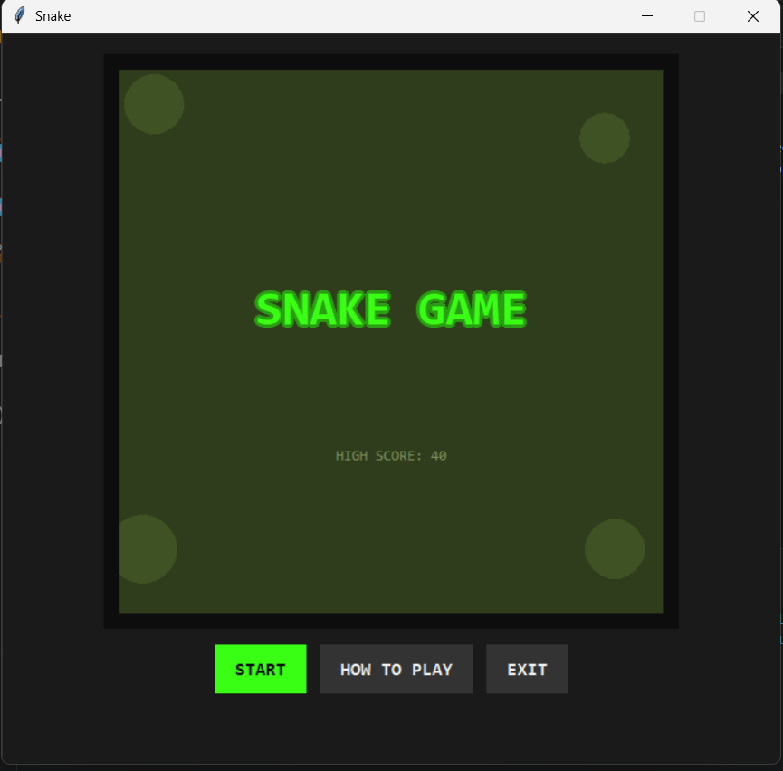
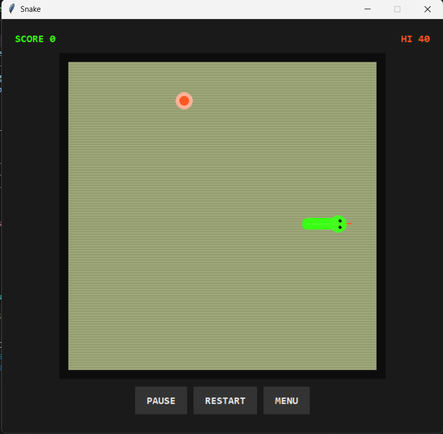

# 🐍 Nokia Retro Snake Game

A retro-style Snake Game built with **Python** and **Tkinter**, inspired by the classic Nokia mobile phones with a modern neon dashboard.

---

## ✨ Features

- 🎮 Classic Snake gameplay
- 💾 Automatic High Score Saving
- 🌟 Nokia Retro Theme
- ⚡ Neon UI Effects
- 📊 Live Score & High Score 
- ⏸ Pause / Resume
- 🔄 Restart after Game Over

---

## 🛠️ Built With:
Python — core game logic

Tkinter — GUI and canvas-based rendering

JSON — for saving/loading the high score

---

📁 **Project Structure**

.

├── snake_game.py     # Main game source code

├── highscore.json    # Auto-generated file storing your high score (created on first run)

└── README.md

---

## 🎮 Controls

| Key           | Action        |
|---------------|---------------|
| ⬆️⬇️⬅️➡️    | Move Snake    |
| Space / P     | Pause / Resume|
| Enter         | Restart       |

---

## 🖥️ Screenshots

### 🏠 Home Screen

### 🎮 Gameplay

---

## 📌 **Future Improvements**
 Add a settings screen (speed presets, color themes)
 
 Add cross-platform sound support (currently uses winsound, Windows only)
 
 Add a numbered arrow-key-navigable main menu for extra retro feel
 
 Add difficulty levels / obstacle modes
 

 ---
 
## 👩‍💻 Author

**Vasudha Saxena**
